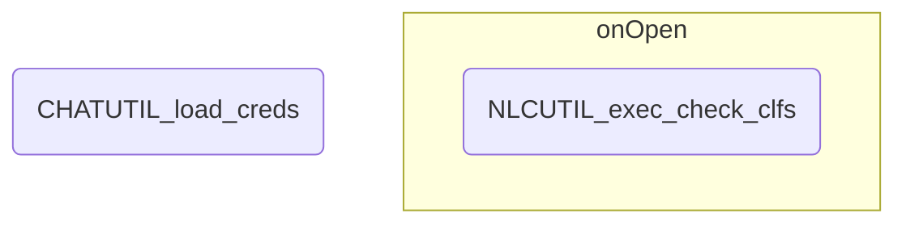

# CHAT 処理概要

## 初期処理
スプレッドシートを開いてから実行される処理

1. グローバル変数の設定

	- 分類器数
    - 設定シートフィールドインデックス
	- 設定メタデータ

2. スプレッドシートIDの取得

	a. バインドされているスプレッドシートオブジェクトを取得する

    b. スプレッドシートオブジェクトからIDを取得する

3. クレデンシャルの取得 (CHATUTIL_load_creds)

	スクリプトプロパティからNLCインスタンスのクレデンシャル情報とLINEアカウントのアクセストークンを取得する

    !!! Note "参照するスクリプトプロパティ"
        | プロパティ名 | 説明 |
        |:---------------|:---------|
        | CREDS_USERNAME | ユーザー名 |
        | CREDS_PASSWORD | パスワード |
        | CREDS_URL | エンドポイント |
        | CHANNEL_ACCESS_TOKEN | チャネルアクセストークン |

4. シートオープン時処理(onOpen)

	a. Watsonメニューの作成

    	学習
		削除
	  	  分類器1
	  	  分類器2
	  	  分類器3

	b. 分類器状態の表示(NLCUTIL_exec_check_clfs)

---

## モジュール構造図

