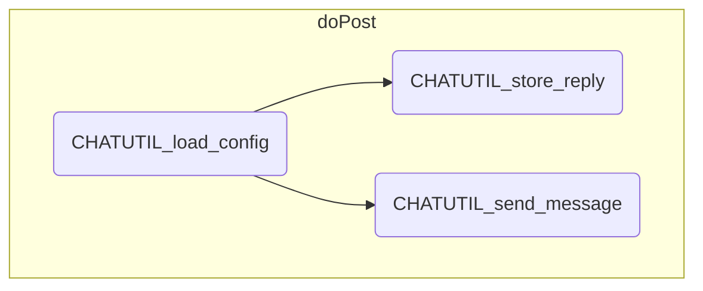

# CHAT 処理概要


## LINE応答処理 (doPost)

LINEからのリクエストに対して応答メッセージを送信する

1. 設定情報の取得 (CHATUTIL_load_config)

2. リクエスト内容の判定

	- リクエストのイベント情報からリプライトークンを取得する

	- リクエストの内容から応答するメッセージを判定する

	|イベント|イベントタイプ|メッセージタイプ|
    |-------|-----------|--------------|
    |友達追加|follow|---|
	|テキストメッセージ|message|text|
    |テキスト以外|message|text以外|

	a. 友達追加

    	設定情報の友達追加メッセージを応答メッセージに設定する
    	応答メッセージをシートに記録する (CHATUTIL_store_reply)
 
 	b. テキストメッセージ
    
   		ルールから選択されたメッセージを応答メッセージに設定し、シートに記録する(CHATUTIL_send_message)

	c. テキスト以外のメッセージ

    	設定情報のテキスト以外のメッセージを応答メッセージに設定する
    	応答メッセージをシートに記録する (CHATUTIL_store_reply)

3. 応答メッセージの送信

	a. 応答JSONデータを編集する

	``` json
		{
			"replyToken": リプライトークン,
		    "messages": [{
		        "type": "text",
				"text": 応答メッセージ,
			}]
		}
	```

	b. 応答JSONデータをPOST送信する

	※ 認証に使用するチャネルアクセストークンは初期処理で取得

---

## モジュール構造図
