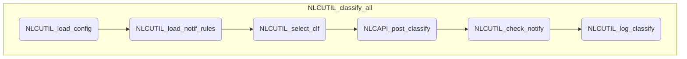

# NLC 処理概要

## 分類処理

シートの分類対象のテキストを各分類器で分類する。

	※ UIが利用可能な場合は、確認ダイアログを表示する

1. 設定情報の取得 (NLCUTIL_load_config)

	メタデータからユーザー設定情報を取得する

2. 通知条件の取得(NLCUTIL_load_notif_rules)

	ユーザー設定情報から通知設定情報を取得する

	a. 以下の条件に該当する場合は０件として処理する

    	- シートが見つからなかった場合
    	- 行または列が０件

3. 分類器情報の取得(NLCUTIL_select_clf)

	各分類器の情報を取得する

4. データシートの読み込み

	データシートが取得できない場合は例外を発生する

5. テキストの分類

	a. 以下の条件に該当する場合は処理をスキップする

		- 分類器の状態が「Available」でない場合
		- 対象テキストがブランクの場合
		- 該当分類器の結果テキストが存在し、上書きモードでない場合

	b. 分類対象テキストの編集

		- 改行、タブは削除する
		- シングル・ダブルクォートはダブルクォートでエスケープする
    	- 前後の空白はトリミングする
		- 長さが1024文字を超える場合は、先頭から1024文字以内に切りつめる

	c. 分類の実行(NLCAPI_post_classify)

		- 各分類器にPOST classifyを実行する

	d. 結果の記入

    APIの実行ステータスが200の場合、設定に従って以下の項目を記入する

    	- 分類結果のtop_class
        - top_classの確信度
        - 実行日時

	e. 結果の通知(NLCUTIL_check_notify)

		- １つ以上の分類器で分類を実行した場合、通知処理を実行する

6. ログ出力 (NLCUTIL_log_classify)

	分類対象が０件の場合、
    

## モジュール構造図

