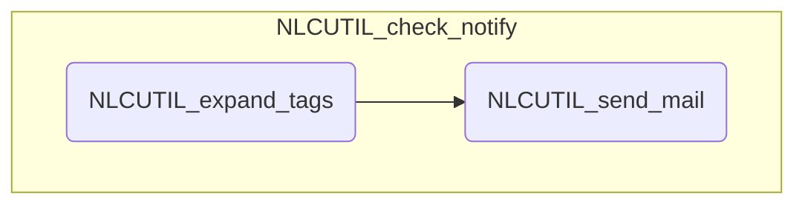

# NLCモジュール 処理概要
## 分類結果通知処理

通知条件のパターンにマッチした分類結果をメールで通知する

1. 分類結果と各通知条件のインテントを比較する

	通知条件のインテントが空白の場合は無条件にマッチする

2. 埋め込みタグの展開(NLCUTIL_expand_tags)

	インテントが全てマッチし、分類結果のいずれかが今回更新されたものの場合、通知設定の件名と本文中の各埋め込みタグを展開する
    
    埋め込みタグ
    [[#列番号]]

3. メールの送信 (NLCUTIL_send_mail)

	通知設定に従って通知メールを送信する

## モジュール構造図

