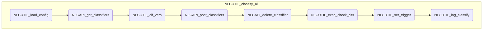

# NLC 処理概要

## 学習処理

分類器を作成し、 シートの学習対象のテキストを学習させる

	※ UIが利用可能な場合は、確認ダイアログを表示する

1. 設定情報の取得 (NLCUTIL_load_config)

	メタデータからユーザー設定情報を取得する

2. 分類器一覧の取得 ([NLCAPI_get_classifiers](../NLCLIB/#NLCAPI_get_classifiers))

3. データシートの読み込み

	データシートが取得できない場合は例外を発生する

	a. 以下の条件に該当する場合は学習データなしとして処理する

    	- 最終行 < 開始行
    	- 最終列 < インテント列
    	- 最終列 < 学習テキスト列

4. 学習データの作成(CSV)

	各行からCSV形式の学習データを作成する

	a. 以下の条件に該当する場合は学習データに含めない

		- インテント名がブランクの場合
		- 学習テキストがブランクの場合

	b. インテント名、学習テキストの編集

		- 改行、タブは削除する
		- シングル・ダブルクォートは、ダブルクォートでエスケープする
    	- 前後の空白はトリミングする
		- 長さが1024文字を超える場合は、先頭から1024文字以内に切りつめる

	c. インテント名、学習テキストをカンマで結合し、学習データに改行(LF)を入れて追加する

5. 学習の実行

	a. 分類器のバージョン一覧の取得 (NLCUTIL_clf_vers)

		分類器名を最新バージョン＋１に設定する

	b. 分類器の作成 (NLCAPI_post_classifiers)

    	NLCのAPIを実行する

	c. 旧バージョンの削除 (NLCAPI_delete_classifier)

    	API実行(status:200)が成功し、分類器が３世代目になる場合はもっとも古いバージョンを削除する

6. 分類器の状態チェック

	a. 分類器の状態を更新する (NLCUTIL_exec_check_clfs)

    	分類器状態更新処理(NLCUTIL_exec_check_clfs)を実行する

	b. 状態更新をタイマーにセットする (NLCUTIL_set_trigger)

    	分類器状態更新処理(NLCUTIL_exec_check_clfs)を指定間隔でタイマーにセットする

6. ログ出力 (NLCUTIL_log_train)

    

## モジュール構造図

