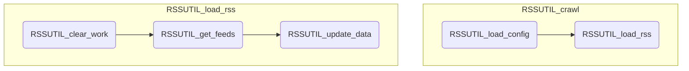

# RSS 処理概要

## フィード取得 (RSSUTIL_crawl)

購読設定されたRSSフィードを取得する

	※ UIが利用可能な場合は、確認ダイアログを表示する

1. 設定情報の取得 (RSSUTIL_load_config))

	メタデータからユーザー設定情報を取得する

2. XXX (RSSUTIL_load_rss)

	取得対象の件数分、以下の処理を繰り返す

	1. クリア ( RSSUTIL_clear_work)

	作業用シートをクリアする

	2. フィードの取得 (RSSUTIL_get_feeds)

	フィードを取得する

	3. データシートの更新 (RSSUTIL_update_data)

	シートを更新する

## モジュール構造図

