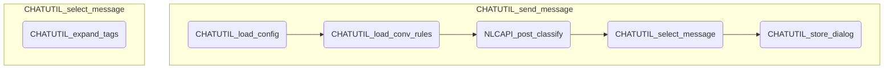

# CHAT 処理概要

## Webチャット応答処理 (CHATUTIL_send_message)

Webチャットからのリクエストに対して応答メッセージを送信する

### 1. 設定情報の取得 (CHATUTIL_load_config)

メタデータからユーザー設定情報を取得する

### 2. 応答設定の取得 (CHATUTIL_load_conv_rules)

ユーザー設定情報から応答設定情報を取得する

1. 以下の条件のいずれかに該当する場合は応答設定なしとして処理する

	!!! tips "条件"

		- シートが見つからなかった場合
		- 行または列が０件

### 3. 入力メッセージの分類

入力メッセージを各分類器で分類する

1. NLCのAPIを実行する (NLCAPI_post_classify)

### 4. 応答メッセージの選択 (CHATUTIL_select_message)

分類結果と各応答条件を比較して、応答メッセージを選定する

!!! warning "例外メッセージ"
	APIの実行ステータスが200以外だった場合は、設定シートの例外メッセージを使用する

1. メッセージの判定

	分類結果と各応答条件を照合し、最初にマッチしたメッセージを応答メッセージとして使用する

	!!! tips "判定方法"

		|インテント|確信度|適合条件|
		|---|---|---|
		|空白|---|すべての分類結果にマッチ|
		|空白以外|空白|分類結果と応答条件のインテント名が一致した場合|
		|空白以外|空白以外|分類結果と応答条件のインテントが一致 かつ 分類結果の確信度が応答条件の確信度以上の場合|

	!!! warning "該当なしメッセージ"
		いずれの応答条件にもマッチしなかった場合は、設定シートの該当なしメッセージを使用する

1. 埋め込みタグの展開(CHATUTIL_expand_tags)

	1. 応答メッセージ中にある、以下の埋め込みタグを置換する

		!!! info "埋め込みタグ"
			|タグ|置換データ|
			|---|----|
			|[[#input]]|入力メッセージ|
			|[[#date]]|現在日付(yyyy年MM月dd日)|
			|[[#time]]|現在時刻(HH時mm分ss秒)|

### 4. 会話履歴の記録 (CHATUTIL_store_dialog)

1. シートが見つからない場合は新規に作成する

1. シートの最終行に以下の項目を追記する

	!!! info "項目"
		- 受信日時
		- 入力メッセージ
		- 応答メッセージ
		- 分類器1のインテント名
		- 分類器1の確信度
		- 分類器1の分類日時
		- 分類器2のインテント名
		- 分類器2の確信度
		- 分類器2の分類日時
		- 分類器3のインテント名
		- 分類器3の確信度
		- 分類器3の分類日時

### 5. 応答メッセージの送信

1. 応答メッセージを送信する

---

## モジュール構造図

