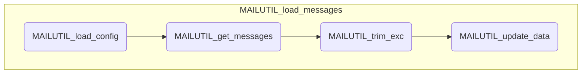

# MAIL 処理概要

## メール取得処理 (MAILUTIL_load_messages)

	※ UIが利用可能な場合は、確認ダイアログを表示する

### 1. 設定情報の取得 (MAILUTIL_load_config)

メタデータからユーザー設定情報を取得する

### 2. メールの取得 (MAILUTIL_get_messages)

1. GmailAppのsearchメソッドでスレッドを取得する

	!!! info "searchメソッドのパラメータ"

		- query: 設定シートのフィルタ
	    - start: 0
		- max: 設定シートの取得スレッド数

1. 各スレッドからメッセージを取得する

	!!! info "取得するメッセージの項目"

		- ID
		- 受信日時
		- From
		- To
		- Cc
		- 件名
		- 本文

	!!! warning "エスケープ処理"
		件名と本文はエスケープ処理(NLCUTIL_escape_formula)する

	!!! tip "取得するメッセージの条件"
		受信日時 >= 取得基準日

	!!! Note "取得基準日の算出方法"
    	1. 設定シートから「過去分取得日数」を取得する
    	1. 過去分取得日数が１以上の場合は（本日 - 過去分取得日数）を基準日とする。
	        ex. 1の場合は「昨日」
	    1. 過去分取得日数が０の場合は、データシート上の受信日時の中から最新の日付を基準日とする。
	        （ただし、対象が存在しなかった場合は「本日」を基準日とする）
	    1. 取得基準日の時刻は00:00:00にリセットする。

### 3. 本文の除外 (MAILUTIL_trim_exc)

設定に従って、本文から不要な文字を除外する

### 4. データシートの更新 (MAILUTIL_update_data)

データシートを更新する

---

## モジュール構造図

