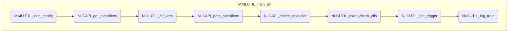

# MAIL 処理概要

## 学習処理 (MAILUTIL_train_all)

分類器を作成し、 シートの学習対象のテキストを学習させる

	※ UIが利用可能な場合は、確認ダイアログを表示する

### 1. 設定情報の取得 (MAILUTIL_load_config)

メタデータからユーザー設定情報を取得する

### 2. 分類器一覧の取得 ([NLCAPI_get_classifiers](../NLCLIB/#NLCAPI_get_classifiers))

APIを実行する

### 3. データシートの読み込み

データシートから学習の元データを取得する

1. データシートが取得できない場合は例外を発生する

1. 以下の条件のいずれかに該当する場合は学習データなしとして処理する

	!!! tip "条件"
	    - 最終行 < 開始行
	    - 最終列 < インテント列
	    - 最終列 < 学習テキスト列

### 4. 学習データの作成(CSV)

各行からCSV形式の学習データを作成する

1. インテント名・件名・本文の編集

	インテント名・件名・本文(処理対象)のぞれぞれのテキストを編集する

	!!! note "編集ルール"
		- 改行、タブは削除する
		- シングル・ダブルクォートは、ダブルクォートでエスケープする
		- 前後の空白はトリミングする

1. 学習対象テキストの選択

	学習・分類対象の設定により、学習対象テキストを決定する

    |学習・分類対象|学習対象テキスト|
	|----|----|
	|件名のみ|件名を使用|
	|本文のみ|本文(処理対象)を使用|
	|件名・本文両方|件名と本文(処理対象)を半角スペースで結合|

	!!! warning "件名・本文結合の例外"
	   	件名・本文(処理対象)のいずれかがブランクの場合は、ブランクでないほうを学習対象テキストとして使用する（両方ともブランクの場合は学習対象外)

	- 長さが1024文字を超える場合は、先頭から1024文字以内に切りつめる

1. 学習データに追加

	- 以下の条件のいずれかに該当する場合は学習データに含めない

	!!! tip "条件"
		- インテント名がブランクの場合
		- 学習テキストがブランクの場合

	1. インテント名、学習テキストをそれぞれダブルクォートで囲む
	1. 上記(a)をカンマで結合する
	1. 学習データに上記(b)を追加して、改行(CR+LF)を付加する

	!!! note "ダブルクォートで囲む理由"
		テキストにカンマなどがある場合を考慮して、ダブルクォートで囲んでおく

### 5. 学習の実行

1. 分類器のバージョン一覧の取得 (NLCUTIL_clf_vers)

	分類器名を最新バージョン＋１に設定する

1. 分類器の作成 (NLCAPI_post_classifiers)

 	NLCのAPIを実行する

1. 旧バージョンの削除 (NLCAPI_delete_classifier)

 	APIの実行ステータスが200で、作成した分類器が３世代目になる場合は１世代目のバージョンを削除する

### 6. 分類器の状態チェック

1. 分類器状態更新処理 (NLCUTIL_exec_check_clfs)

	設定シートに表示されている分類器の状態を更新する

2. 状態更新処理をタイマーにセットする (NLCUTIL_set_trigger)

	分類器状態更新処理(NLCUTIL_exec_check_clfs)を指定間隔でタイマーにセットする

### 7. ログ出力 (NLCUTIL_log_train)

---

## モジュール構造図

