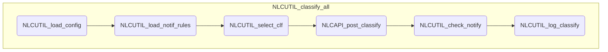

# NLC 処理概要

## 分類処理

シートの分類対象のテキストを各分類器で分類する。

	※ UIが利用可能な場合は、確認ダイアログを表示する

### 1. 設定情報の取得 (NLCUTIL_load_config)

メタデータからユーザー設定情報を取得する

### 2. 通知条件の取得(NLCUTIL_load_notif_rules)

ユーザー設定情報から通知設定情報を取得する

1. 以下の条件のいずれかに該当する場合は通知設定なしとして処理する

	!!! tips "条件"

		- シートが見つからなかった場合
		- 行または列が０件

### 3. 分類器情報の取得(NLCUTIL_select_clf)

各分類器の情報を取得する

### 4. データシートの読み込み

1. データシートが取得できない場合は例外を発生する

### 5. テキストの分類

1. 以下の条件に該当する場合は以降の処理をスキップする

	!!! tips "条件"

		- 分類器の状態が「Available」でない場合
		- 対象テキストがブランクの場合
		- 該当分類器の結果テキストが存在し、上書きモードでない場合

1. 分類対象テキストの編集

	!!! note "編集ルール"

		- 改行、タブは削除する
		- シングル・ダブルクォートはダブルクォートでエスケープする
		- 前後の空白はトリミングする
		- 長さが1024文字を超える場合は、先頭から1024文字以内に切りつめる

1. 分類の実行(NLCAPI_post_classify)

	各分類器にPOST classifyを実行する

1. 結果の記入

	1. APIの実行ステータスが200の場合、設定に従って以下の項目を記入する

	!!! info "分類結果"

    	|列|項目|
        |---|--|
        |Watson|分類結果のtop_class|
        |確信度|top_classの確信度|
        |処理日時|実行日時|

1. 結果の通知(NLCUTIL_check_notify)

	1. １つ以上の分類器で分類を実行した場合、通知処理を実行する

### 6. ログ出力 (NLCUTIL_log_classify)

---

## モジュール構造図

