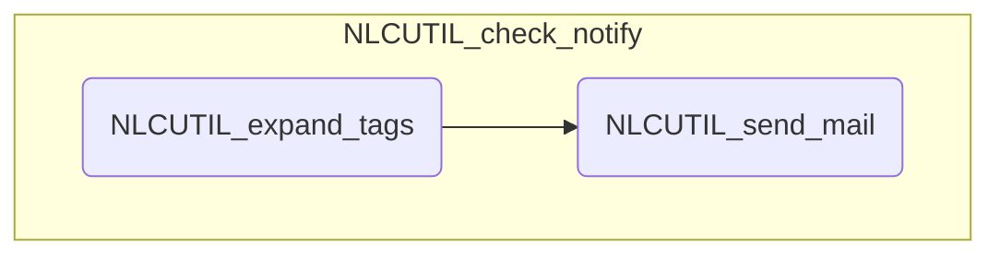

# NLC 処理概要

## 分類結果通知処理 (NLCUTIL_check_notify)

通知条件のパターンにマッチした分類結果をメールで通知する

### 1. インテントの照合

分類結果と各通知条件のインテントを比較して、通知対象を判定する

!!! tips "通知対象の条件"

	- インテントが全てマッチ
	- 分類結果のいずれかが今回更新されてもの

!!! warning "ワイルドカード"
	通知条件のインテントが空白の場合は無条件にマッチする

### 2. 埋め込みタグの展開(NLCUTIL_expand_tags)

1. 以下の条件の全てに該当する、通知設定の件名と本文中の埋め込みタグについて、参照先の列の値で置換する

	!!! info "埋め込みタグ"
		|書式|説明|
		|---|----|
		|[[#列番号]]|シャープの後ろに参照するデータシートの列番号を指定し、２重ブラケットで囲む|

### 3. メールの送信 (NLCUTIL_send_mail)

通知設定に従って通知メールを送信する

---

## モジュール構造図

