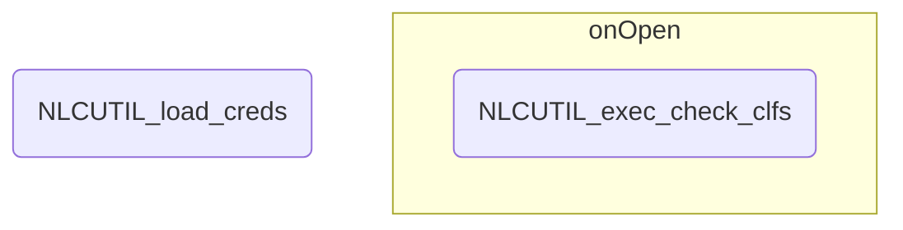

# RSS 処理概要

## 初期処理
スプレッドシートを開いてから実行される処理

### 1. グローバル変数の設定

- 分類器数
- 設定シートフィールドインデックス
- 設定メタデータ

### 2. スプレッドシートIDの取得

1. バインドされているスプレッドシートオブジェクトを取得する

1. スプレッドシートオブジェクトからIDを取得する

### 3. クレデンシャルの取得 (NLCUTIL_load_creds)

スクリプトプロパティからNLCインスタンスのクレデンシャル情報を取得する

!!! Note "参照するスクリプトプロパティ"
    | プロパティ名 | 説明 |
    |:---------------|:---------|
    | CREDS_USERNAME | ユーザー名 |
    | CREDS_PASSWORD | パスワード |
    | CREDS_URL | エンドポイント |

### 4. シートオープン時処理(onOpen)

1. Watsonメニューの作成

	!!! info "メニュー構成"

    	- データ取得 (RSSUTIL_crawl)
		- 分類 (RSSSTIL_classify_all)
		- 学習 (RSSSTIL_train_all)
		- 削除
			- 分類器1 (NLCUTIL_del_clf1)
			- 分類器2 (NLCUTIL_del_clf2)
			- 分類器3 (NLCUTIL_del_clf3)

1. 分類器状態の表示(NLCUTIL_exec_check_clfs)

---

## モジュール構造図

